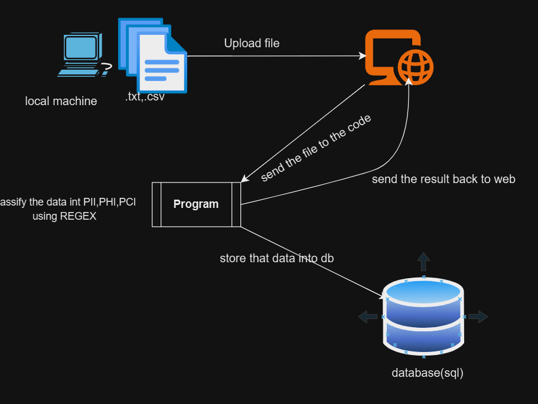
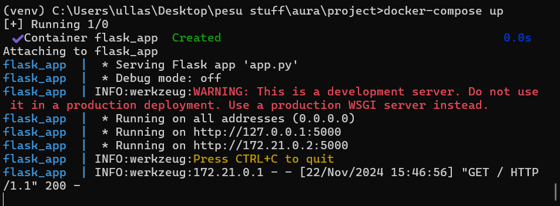
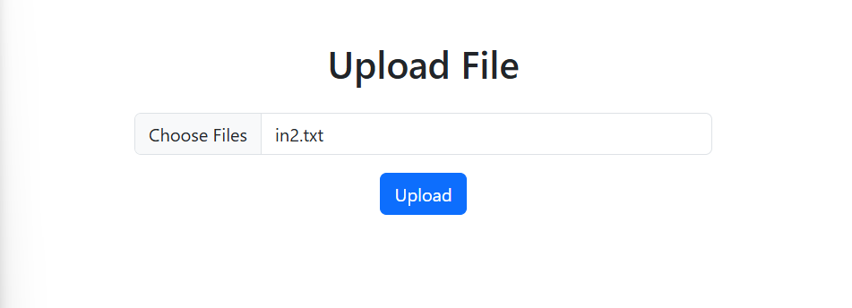
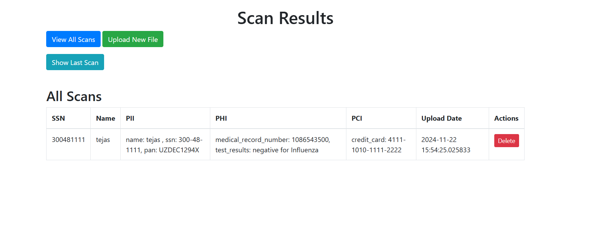
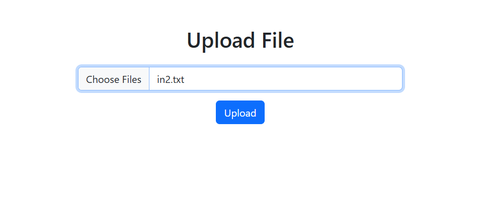
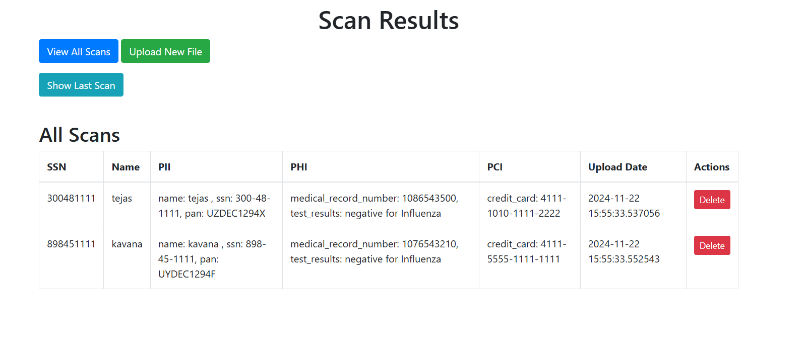
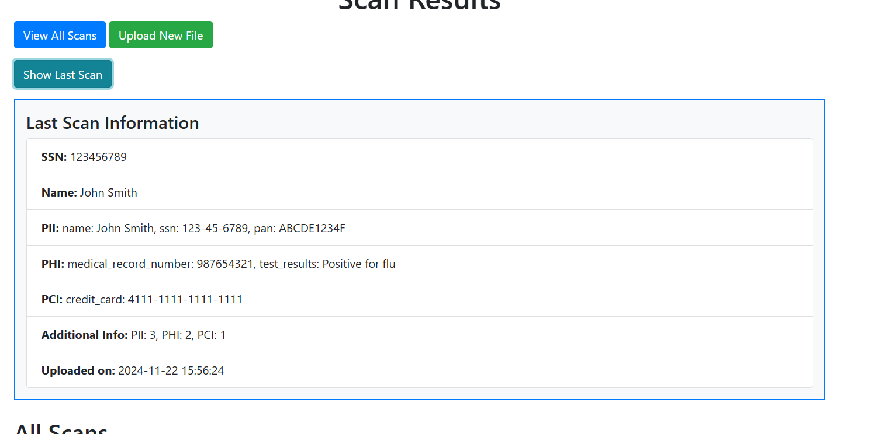

# Aura Project

## Overview
This project is a Flask-based web application designed to:
- Upload and process various file formats (`.txt`, `.csv`).
- Extract and classify data into categories such as **PII** (Personally Identifiable Information), **PHI** (Protected Health Information), and **PCI** (Payment Card Information).
- Store the processed data in a database, allowing for record management, search functionality, and retrieval of the latest record.
- Deployed using **Docker** for easy setup and scalability.

## Features

1. **File Upload and Processing**:
   - Supports uploading multiple files at once.
   - Extracts text from images, PDFs, and CSV rows using OCR (`easyocr`) and text-parsing techniques.

2. **Data Classification**:
   - Categorizes extracted information into:
     - **PII**: Name, SSN, PAN.
     - **PHI**: Medical Record Numbers, Test Results.
     - **PCI**: Credit Card Numbers.

3. **Record Management**:
   - Automatically updates records if the same **SSN** is uploaded again, ensuring no duplicate entries.
   - Allows searching for records by **SSN**.
   - Provides functionality to retrieve the latest uploaded record.

4. **View and Delete Records**:
   - View all records stored in the database via a user-friendly web interface.
   - Delete individual records as required.

5. **Dockerized Deployment**:
   - The project is containerized using Docker.
   - Includes a `Dockerfile` and `docker-compose.yml` for easy setup.
   - Orchestrates the Flask application and database.

---

## System Diagram


## Database Design
The database contains a single table called `scan`, with the following structure:

| Column          | Type          | Description                                     |
|------------------|---------------|-------------------------------------------------|
| `id`            | Integer       | Primary key (autoincrement).                   |
| `ssn`           | String        | Unique identifier for the record.              |
| `name`          | String        | Name associated with the record.               |
| `pii`           | String        | Combined PII information.                      |
| `phi`           | String        | Combined PHI information.                      |
| `pci`           | String        | Combined PCI information.                      |
| `additional_info` | String      | Summary of PII, PHI, and PCI counts.           |
| `upload_date`   | DateTime      | Timestamp of when the record was uploaded.     |

---
## Explanation of the Schema:

- id: A unique identifier for each record.
- name: The full name of the individual.
- ssn: The Social Security Number, masked or hashed for security.
- pan: The Permanent Account Number, masked or hashed for security.
- medical_record_number: The unique identifier for the medical record.
- test_results: The results of the medical test.
- credit_card_number: The credit card number, masked or tokenized for security.
- upload_date: The timestamp when the record was uploaded.


## Setup Instructions

### Prerequisites
- Python 3.x
- Pip (Python package manager)
- SQLite (comes pre-installed with Python)

### Steps to Run the Project Locally
1. Clone the repository:
   ```bash
   git clone <repository_url>
   cd aura-project
   ```

2. Create a virtual environment and activate it:
   - On Windows:
     ```bash
     python -m venv venv
     .\venv\Scripts\activate
     ```
   - On Mac/Linux:
     ```bash
     python3 -m venv venv
     source venv/bin/activate
     ```

3. Install the required dependencies:
   ```bash
   pip install -r requirements.txt
   ```

4. Run the application:
   ```bash
   python app.py
   ```

5. Open your browser and navigate to `http://127.0.0.1:5000/` to access the app.

## Docker Setup (Optional)
1. Build the Docker image:
   ```bash
   docker build -t aura-app .
   ```

2. Start the application using Docker Compose:
   ```bash
   docker-compose up
   ```
## Output Snapshot

Here is a snapshot of the application output:
Running Docker

uplode textfile

scan list

uplode 2 file at a time

scan list

uplode csv

scan list

latest scan


## Future Enhancements

If more time and resources were available, the following improvements and features could be implemented:

1. **Database Improvements**  
   - Normalize the database to improve data integrity and reduce redundancy.
   - Optimize queries for better performance with larger datasets.
   - here is the how db looks
   # Normalized Database Design

This document describes the normalized design for the database, which eliminates redundancy and organizes the data into logical groupings.

---

## 1. Main Table: `scans`
Stores general information about each scan.

| Column          | Type          | Description                                     |
|------------------|---------------|-------------------------------------------------|
| `id`            | Integer       | Primary key (autoincrement).                   |
| `ssn`           | String        | Unique identifier for the record.              |
| `name`          | String        | Name associated with the record.               |
| `upload_date`   | DateTime      | Timestamp of when the record was uploaded.     |

---

## 2. PII Table: `pii`
Stores personally identifiable information (PII) associated with a scan.

| Column          | Type          | Description                                     |
|------------------|---------------|-------------------------------------------------|
| `id`            | Integer       | Primary key (autoincrement).                   |
| `scan_id`       | Integer       | Foreign key referencing `scans.id`.            |
| `type`          | String        | Type of PII (e.g., `name`, `ssn`, `pan`).      |
| `value`         | String        | The PII value.                                 |

---

## 3. PHI Table: `phi`
Stores protected health information (PHI) associated with a scan.

| Column          | Type          | Description                                     |
|------------------|---------------|-------------------------------------------------|
| `id`            | Integer       | Primary key (autoincrement).                   |
| `scan_id`       | Integer       | Foreign key referencing `scans.id`.            |
| `type`          | String        | Type of PHI (e.g., `medical_record_number`, `test_results`). |
| `value`         | String        | The PHI value.                                 |

---

## 4. PCI Table: `pci`
Stores payment card information (PCI) associated with a scan.

| Column          | Type          | Description                                     |
|------------------|---------------|-------------------------------------------------|
| `id`            | Integer       | Primary key (autoincrement).                   |
| `scan_id`       | Integer       | Foreign key referencing `scans.id`.            |
| `value`         | String        | Credit card number or related PCI data.        |

---

## 5. Additional Info Table: `scan_metadata`
Stores metadata about the counts of PII, PHI, and PCI in a scan.

| Column          | Type          | Description                                     |
|------------------|---------------|-------------------------------------------------|
| `id`            | Integer       | Primary key (autoincrement).                   |
| `scan_id`       | Integer       | Foreign key referencing `scans.id`.            |
| `pii_count`     | Integer       | Count of PII items in the scan.                |
| `phi_count`     | Integer       | Count of PHI items in the scan.                |
| `pci_count`     | Integer       | Count of PCI items in the scan.                |

---

## Relationships
- The `scans` table acts as the parent, with one-to-many relationships to the `pii`, `phi`, `pci`, and `scan_metadata` tables.
- Foreign keys (`scan_id`) in the child tables ensure data integrity and establish relationships.

---

## Advantages of Normalization
1. **Eliminates Redundancy:** Data is stored once and referenced as needed, reducing storage requirements.
2. **Improves Data Integrity:** Foreign keys ensure valid relationships between tables.
3. **Facilitates Flexibility:** Adding new data types or columns is simpler without affecting unrelated tables.
4. **Optimizes Queries:** Targeted queries can retrieve specific data without scanning large, monolithic tables.

---

Would you like SQL scripts or an ER diagram to complement this normalized design?


2. **File Type Support**  
   - Extend support to additional file types, such as `.peg` images and advanced PDF structures.

3. **Handling Multiple Records in a Single File**  
   - Develop functionality to parse and handle files containing multiple records efficiently, allowing batch processing.

4. **Enhanced User Experience**  
   - Implement features like file upload progress indicators and detailed logs for user feedback.

5. **Scalability and Deployment**  
   - Transition from SQLite to a more scalable database like PostgreSQL or MySQL for production environments.
   - Add support for horizontal scaling with distributed databases and optimized container configurations.

These enhancements would make the application more robust, scalable, and user-friendly.


# Code Quality Tools: Flake8 and Black

## 1. Flake8
Flake8 is a linter that checks your Python code for various issues related to:

- **Syntax Errors**: Ensures your code is syntactically correct (e.g., unmatched parentheses, misspelled keywords).
- **Style Violations**: Enforces PEP 8, Python's style guide (e.g., indentation errors, line length).
- **Code Complexity**: Flags overly complex code that might be hard to maintain or understand.
- **Unused Imports/Variables**: Detects unused code, such as imports or variables that are declared but not used.

### How to use Flake8:
1. **Install Flake8**:
    ```bash
    pip install flake8
    ```

2. **Run the Linter**:
    In your project directory, run:
    ```bash
    flake8 .
    ```
    This will check all Python files in the current directory and subdirectories for any issues.

3. **Fix Issues**:
    Flake8 will output a list of issues, including the line numbers where problems were found. You'll need to address these issues manually to ensure your code is clean and follows the style guidelines.

## 2. Black
Black is an automatic code formatter for Python. It formats your code to follow consistent and strict formatting rules, primarily based on PEP 8 but with additional features. Its goal is to make code formatting consistent and reduce the need for code style debates among teams.

### Features of Black:
- **Auto-formatting**: Reformats your code to match a specific style (e.g., 88-character line length, spaces around operators, etc.).
- **No Configuration**: Black follows a set of defaults and doesn't require configuring style rules, making it easy to use for teams.

### How to use Black:
1. **Install Black**:
    ```bash
    pip install black
    ```

2. **Run Black**:
    In your project directory, run:
    ```bash
    black .
    ```
    Black will automatically format all the Python files in your project, making your code consistent.

## 3. Combining Flake8 and Black
- **Flake8** is useful for detecting issues and maintaining a clean codebase by catching mistakes.
- **Black** is great for automatically formatting your code to ensure consistent style.

### Example Workflow:
1. **Run Flake8**:
    ```bash
    flake8 .
    ```
    - Review the output and fix any linting issues manually (e.g., correct indentation, remove unused imports).

2. **Run Black**:
    ```bash
    black .
    ```
    - This will automatically format your code.

By using both tools together, you can ensure that your code is both error-free and follows a consistent style.
"""
# Running Tests for Flask Application

This guide explains how to run the tests for the Flask application and provides an overview of the expected behavior during testing.

## Prerequisites


## Setting up the Database
Tests use a SQLite database for testing purposes, which will be created and cleaned up automatically during test runs. The application will use an in-memory database (sqlite:///test_database.db) for testing purposes to avoid affecting the production database.

## Running Tests
To run the tests, execute the following command in your terminal:

```bash
Copy code
pytest tests/test_app.py
This will run the tests and display a summary of the results in the terminal.

Expected Test Output
When running the tests, you should see output similar to the following:

bash
Copy code
============================= test session starts ==============================
collected 8 items

tests/test_app.py .......                                             [100%]

============================= 8 passed in 1.23s ==============================
```
If any test fails, the output will show which test failed, along with the relevant error message. You will also see the stack trace to help debug the issue.

#Handling Database Errors
If you encounter issues such as sqlite3.IntegrityError, it may be due to unique constraints in the database or conflicts between test cases. Ensure that:

Each test case is properly isolated.
Any data added to the database during tests is cleaned up after each test.
Handling DetachedInstanceError
In case you encounter the DetachedInstanceError, it indicates that you're trying to access an object outside of the session context. To resolve this, make sure database operations are performed within an app context.

Example of fixing:
python
Copy code
with app.app_context():
    # Your DB operations go here
Test Cases Overview
Here is a summary of the tests implemented in test_app.py:

Home Route (test_home): Verifies that the home route returns the correct status and displays the "Upload File" text.
Upload File Route (Valid File) (test_upload_text_file): Tests the file upload route with a valid .txt file. Checks for a redirect to the /scans page.
Upload File Route (Missing File) (test_upload_missing_file): Ensures that the application handles a case where no file is uploaded.
List Scans (test_list_scans): Verifies the /scans route displays scans stored in the database.
Search Scan (Valid SSN) (test_search_scan_valid): Tests the search functionality by searching for a scan with a valid SSN.
Search Scan (Invalid SSN) (test_search_scan_invalid): Verifies the behavior when searching for a non-existing scan.
Delete Scan (test_delete_scan): Ensures that scans can be deleted from the database and no longer exist.
Get Last Scan (test_last_scan): Verifies that the last scan added to the database can be retrieved.
